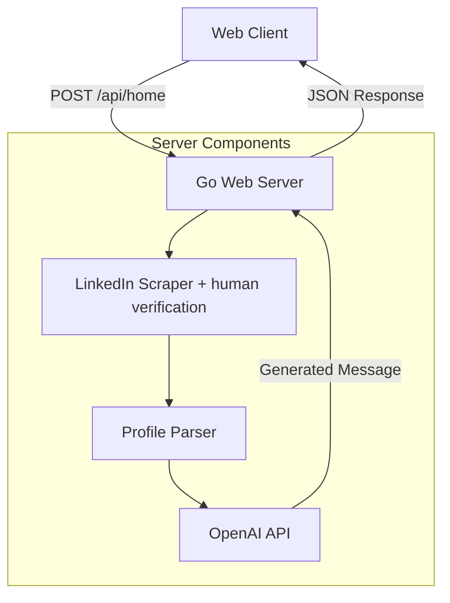

[](https://golang.org/)

Generate personalized connection messages for LinkedIn profiles using AI. The system analyzes a target profile's posts, experience, and education to create relevant connection requests.

## 🏗️ Architecture



## 🛠️ Tech Stack
- **Backend**: Go web server
- **Frontend**: HTML, CSS, JavaScript
- **Scraping**: chromedp (non-headless)
- **AI**: OpenAI GPT-4o-mini
- **Container**: Docker (for Frontend)

## ⚡ Prerequisites
- Go (latest version)
- Docker
- OpenAI API key
- Chrome browser

## 🔐 Go Server Environment Variables (use export <key>=<val>)
```bash
PORT=3100               # API port (defaults to 3100)
OPENAI_API_KEY=<key>    # OpenAI authentication key
```

## 📚 API Specification

<details>
<summary>POST /api/home</summary>

Generate a connection message for a LinkedIn profile.

**Request Body:**
```go
type HomeReq struct {
    Email       string `json:"email"`
    Password    string `json:"password"`
    LinkedinUrl string `json:"linkedinUrl"`
}
```

**Response:**
```go
type HomeRes struct {
    Msg         string   `json:"msg"`
    ParamsUsed  []string `json:"paramsUsed"`
    RecentPosts string   `json:"recentPosts"`
}
```
</details>

## 🔄 Scraping Logic
1. Extract user's name and location
2. Collect latest 5 posts (excluding reposts)
3. If fewer than 2 posts are found:
   - Scrape user's experience
   - Scrape user's education
4. Compile data into Profile struct
5. Generate connection message using GPT-4o-mini (temperature: 0.3)

## 🚀 Local Setup

1. Clone the repository
```bash
git clone git@github.com:hemantsharma1498/segwise-assignment.git
cd segwise-assignment
```

2. Set OpenAI API key
```bash
export OPENAI_API_KEY=<your-key-here>
```

3. Start Docker container
```bash
docker-compose up --build -d
```

4. Start Go server
```bash
cd sgw-server
go run cmd/segwise/main.go
```

## 📝 Usage Instructions

1. Ensure clear desktop environment with server terminal visible
2. Open Chrome and navigate to `localhost:8080`
3. Enter credentials:
   - LinkedIn email
   - LinkedIn password
   - Target profile URL (including https://)
4. Click "Analyze Profile"
5. If human verification appears:
   - Select correct image
   - Return to terminal
   - Press Enter to continue
6. Wait 30-35 seconds for message generation

## 💰 Cost Analysis (Monthly)

<details>
<summary>Basic Setup ($6.5/month)</summary>

- DigitalOcean Droplet: $4
- OpenAI API (150 requests): $2.5
  - 550 tokens/request
  - 5 requests/day
  - 30 days/month
</details>

<details>
<summary>With Proxy ($13.5-21.5/month)</summary>

- Basic Setup: $6.5
- Rotating Proxy (IPRoyal/Bright Data): $7-15
</details>

## 📋 Technical Notes

### Personal notes and Future Considerations
1. Server containerization blocked due human verification requirement on every login
2. Single endpoint architecture
3. No WebSocket implementation for real-time updates (and making the wait bearable)
4. No authentication system in current implementation, add thread-safe JSON file for minimal authentication storage. For such a use case, sqlite/mysql/postgres is not needed
5. Explore automated verification bypass solutions (selenium?)

## 🙏 Credits
- Claude AI: Scraping guidance and README generation

